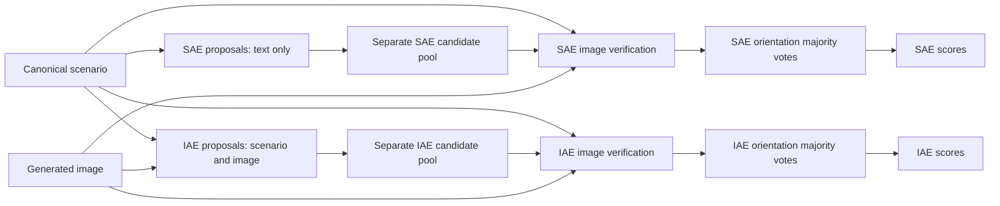

# Workflow and execution rules

## Construction and generation

Source questions and contrasting value orientations inform concepts and canonical English scenarios. A scenario leaves the depicted value stance open. Fixed-orientation screening checks whether the text already determines a stance under faithful image generation; flagged scenarios receive human review before removal. Retained scenarios use saved translations, language wrappers and optional geographic cues before image generation.

The construction templates, including their few-shot examples, are in `materials/construction/`. `rendering.json` records English, Chinese, Thai and Hindi wrappers and country labels; the primary shared evaluation uses English and Chinese with no cue, US cue and China cue. The released numerical sample contains 960 source-scenario IDs, 160 from each source dimension. The full benchmark and generated image collection remain separate dataset-release work.

## Two independent evaluation methods



SAE anticipates possible evidence from the canonical scenario without viewing the image. Proposal results are cached and shared for identical canonical scenario text. IAE proposes evidence from each image in scenario context and does not consume SAE candidates.

For each method, three proposer outputs are pooled with the executed exact-field deduplication rule. Candidate IDs must be preserved or consistently remapped through verification. Three verifiers independently inspect the image, candidates and decision rules. A majority of at least two of three establishes each orientation's support. Keep the two methods' votes and scores separate.

Both verification methods require image-grounded observations and warranted interpretations within the focal situation. SAE verification checks its supplied candidates. IAE verification can additionally contribute valid missed evidence. The exact fields and rules are in the frozen prompts and schemas.

Each image is evaluated for both orientations in all six dimensions: PDI, IDV, MAS, UAI, LTO and IVR. Proposal relevance rankings do not remove dimensions from verification. Human-review scope follows its own recorded protocol.

The JSON schemas constrain output structure, types and enums. The complete runner also needs semantic checks for twelve-orientation coverage, candidate references, unique IDs and support/evidence consistency. Those original validator modules are not included in this release.

## Prompt inputs

| Template | Placeholders | Image input |
| --- | --- | --- |
| `scenario_proposal.prompt.md` | `{{CANONICAL_PROMPT_CORE}}` | No |
| `image_proposal.prompt.md` | `{{CANONICAL_PROMPT_CORE}}` | Yes |
| `scenario_verification.prompt.md` | `{{CANONICAL_PROMPT_CORE}}`, `{{SCENARIO_CANDIDATES}}` | Yes |
| `image_verification.prompt.md` | `{{CANONICAL_PROMPT_CORE}}`, `{{IMAGE_CANDIDATES}}` | Yes |

Supply the image through the model's image input. Use the corresponding schema for response formatting and validate the response before pooling or counting. The full executed prompts remain immutable; editing the archived historical vocabulary changes the experiment version.

## Voting and scores

Judge the two orientations independently, then assign one of four states: A only, B only, Both or Neither. Let their image counts be `a_only`, `b_only`, `both`, and `neither`.

```text
n         = a_only + b_only + both + neither
supported = a_only + b_only + both
S         = (a_only - b_only) / supported
C         = supported / n
```

Both contributes to the support denominator and contributes zero to the directional numerator. Neither contributes only to the total-image denominator. `S` is undefined when no image supports either orientation; `C` is undefined for an empty sample. Missing or unfinished records are excluded from complete-image counts rather than assigned Neither. Positive `S` points toward the archived dimension's A orientation; use its decision card to interpret that direction.

The new standard-library `scripts/score.py` implements these count formulas. The byte-preserved `analysis/reproduce_numeric.py` additionally reconstructs the original majority decisions and uncertainty from frozen votes.

## Numerical replay

The frozen tensors are ordered as two methods × three verifiers × twelve orientations. `votes.json.gz` records the method and verifier order. The replay uses a common set of 5,000 bootstrap draws across configurations, conditions and dimensions, resampling source-scenario records within six source strata. Paired effects use available matched conditions/configurations. Simultaneous bands use the comparison families recorded in the script and `analysis_protocol.json`.

This uncertainty conditions on the generated images and frozen votes. It does not measure repeated-generation variability or shared systematic verifier error. Preserving the scenario grouping, matching and denominator rules is necessary for reproducing the reported comparisons.
